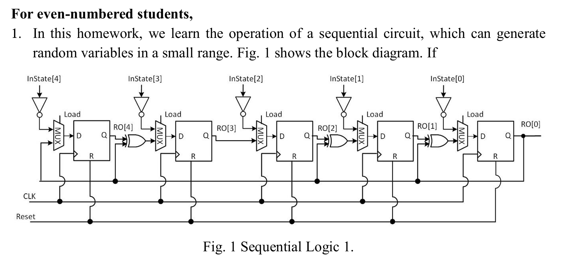
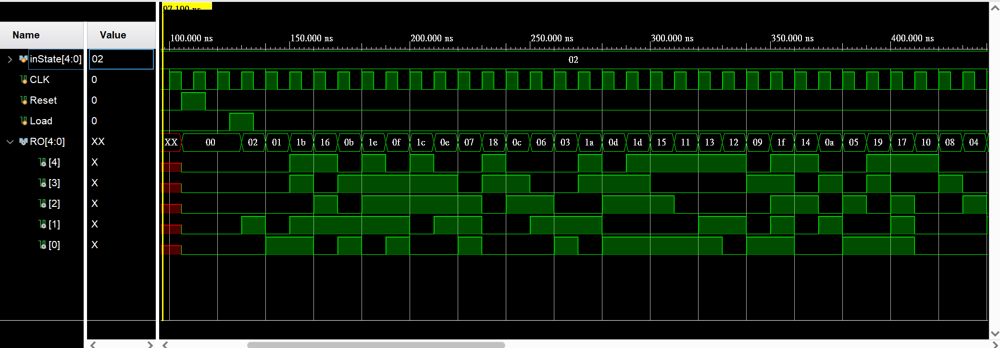

# Required

# Vivado sim out


# Vivado output log
```log
CLK=1, Reset=0, Load=0, inState=00010, RO=xxxxx, Time=                 100
CLK=0, Reset=1, Load=0, inState=00010, RO=00000, Time=                 105
CLK=1, Reset=1, Load=0, inState=00010, RO=00000, Time=                 110
CLK=0, Reset=0, Load=0, inState=00010, RO=00000, Time=                 115
CLK=1, Reset=0, Load=0, inState=00010, RO=00000, Time=                 120
CLK=0, Reset=0, Load=1, inState=00010, RO=00000, Time=                 125
CLK=1, Reset=0, Load=1, inState=00010, RO=00010, Time=                 130
CLK=0, Reset=0, Load=0, inState=00010, RO=00010, Time=                 135
CLK=1, Reset=0, Load=0, inState=00010, RO=00001, Time=                 140
CLK=0, Reset=0, Load=0, inState=00010, RO=00001, Time=                 145
CLK=1, Reset=0, Load=0, inState=00010, RO=11011, Time=                 150
CLK=0, Reset=0, Load=0, inState=00010, RO=11011, Time=                 155
CLK=1, Reset=0, Load=0, inState=00010, RO=10110, Time=                 160
CLK=0, Reset=0, Load=0, inState=00010, RO=10110, Time=                 165
CLK=1, Reset=0, Load=0, inState=00010, RO=01011, Time=                 170
CLK=0, Reset=0, Load=0, inState=00010, RO=01011, Time=                 175
CLK=1, Reset=0, Load=0, inState=00010, RO=11110, Time=                 180
CLK=0, Reset=0, Load=0, inState=00010, RO=11110, Time=                 185
CLK=1, Reset=0, Load=0, inState=00010, RO=01111, Time=                 190
CLK=0, Reset=0, Load=0, inState=00010, RO=01111, Time=                 195
CLK=1, Reset=0, Load=0, inState=00010, RO=11100, Time=                 200
CLK=0, Reset=0, Load=0, inState=00010, RO=11100, Time=                 205
CLK=1, Reset=0, Load=0, inState=00010, RO=01110, Time=                 210
CLK=0, Reset=0, Load=0, inState=00010, RO=01110, Time=                 215
CLK=1, Reset=0, Load=0, inState=00010, RO=00111, Time=                 220
CLK=0, Reset=0, Load=0, inState=00010, RO=00111, Time=                 225
CLK=1, Reset=0, Load=0, inState=00010, RO=11000, Time=                 230
CLK=0, Reset=0, Load=0, inState=00010, RO=11000, Time=                 235
CLK=1, Reset=0, Load=0, inState=00010, RO=01100, Time=                 240
CLK=0, Reset=0, Load=0, inState=00010, RO=01100, Time=                 245
CLK=1, Reset=0, Load=0, inState=00010, RO=00110, Time=                 250
CLK=0, Reset=0, Load=0, inState=00010, RO=00110, Time=                 255
CLK=1, Reset=0, Load=0, inState=00010, RO=00011, Time=                 260
CLK=0, Reset=0, Load=0, inState=00010, RO=00011, Time=                 265
CLK=1, Reset=0, Load=0, inState=00010, RO=11010, Time=                 270
CLK=0, Reset=0, Load=0, inState=00010, RO=11010, Time=                 275
CLK=1, Reset=0, Load=0, inState=00010, RO=01101, Time=                 280
CLK=0, Reset=0, Load=0, inState=00010, RO=01101, Time=                 285
CLK=1, Reset=0, Load=0, inState=00010, RO=11101, Time=                 290
CLK=0, Reset=0, Load=0, inState=00010, RO=11101, Time=                 295
CLK=1, Reset=0, Load=0, inState=00010, RO=10101, Time=                 300
CLK=0, Reset=0, Load=0, inState=00010, RO=10101, Time=                 305
CLK=1, Reset=0, Load=0, inState=00010, RO=10001, Time=                 310
CLK=0, Reset=0, Load=0, inState=00010, RO=10001, Time=                 315
CLK=1, Reset=0, Load=0, inState=00010, RO=10011, Time=                 320
CLK=0, Reset=0, Load=0, inState=00010, RO=10011, Time=                 325
CLK=1, Reset=0, Load=0, inState=00010, RO=10010, Time=                 330
CLK=0, Reset=0, Load=0, inState=00010, RO=10010, Time=                 335
CLK=1, Reset=0, Load=0, inState=00010, RO=01001, Time=                 340
CLK=0, Reset=0, Load=0, inState=00010, RO=01001, Time=                 345
CLK=1, Reset=0, Load=0, inState=00010, RO=11111, Time=                 350
CLK=0, Reset=0, Load=0, inState=00010, RO=11111, Time=                 355
CLK=1, Reset=0, Load=0, inState=00010, RO=10100, Time=                 360
CLK=0, Reset=0, Load=0, inState=00010, RO=10100, Time=                 365
CLK=1, Reset=0, Load=0, inState=00010, RO=01010, Time=                 370
CLK=0, Reset=0, Load=0, inState=00010, RO=01010, Time=                 375
CLK=1, Reset=0, Load=0, inState=00010, RO=00101, Time=                 380
CLK=0, Reset=0, Load=0, inState=00010, RO=00101, Time=                 385
CLK=1, Reset=0, Load=0, inState=00010, RO=11001, Time=                 390
CLK=0, Reset=0, Load=0, inState=00010, RO=11001, Time=                 395
CLK=1, Reset=0, Load=0, inState=00010, RO=10111, Time=                 400
CLK=0, Reset=0, Load=0, inState=00010, RO=10111, Time=                 405
CLK=1, Reset=0, Load=0, inState=00010, RO=10000, Time=                 410
CLK=0, Reset=0, Load=0, inState=00010, RO=10000, Time=                 415
CLK=1, Reset=0, Load=0, inState=00010, RO=01000, Time=                 420
CLK=0, Reset=0, Load=0, inState=00010, RO=01000, Time=                 425
CLK=1, Reset=0, Load=0, inState=00010, RO=00100, Time=                 430
CLK=0, Reset=0, Load=0, inState=00010, RO=00100, Time=                 435
CLK=1, Reset=0, Load=0, inState=00010, RO=00010, Time=                 440
CLK=0, Reset=0, Load=0, inState=00010, RO=00010, Time=                 445
CLK=1, Reset=0, Load=0, inState=00010, RO=00001, Time=                 450
```